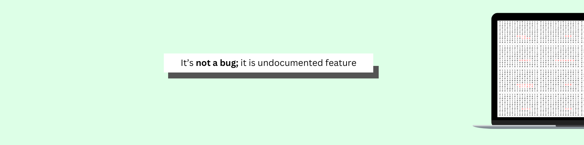

  <h1>Hello World! I'm Rajeshbabu S 👋</h1>
  
<strong>AI Engineer | Full-Stack Developer | Ex-Intern @ God Particles</strong>

  

    
    
    
    
    
  

---

### 💫 About Me

I am an MSc Information Technology student at Anna University, Chennai (College of Engineering, Guindy), passionate about development and AI. 

* 🧠 **AI Engineering**: Building real-world Retrieval-Augmented Generation (RAG) applications using FastAPI and the Google Gemini API.
* 💻 **Full-Stack Development**: Expanding my foundation in React into end-to-end full-stack solutions with Supabase and PostgreSQL.
* ☕ **Data Structures & Algorithms**: Mastering Java for DSA to build robust, highly optimized backend architectures.
* 💼 **Professional Experience**: Gained hands-on industry experience as a Web Developer Intern at God Particles, working on real-world development projects.
* 👥 **Leadership & Tech Communities**:
  * Technical Operations Organizer – CEG Tech Forum (Dec 2024 – Feb 2025)
  * Domain Representative & Event Organizer – Math Computing Society (Oct 2024 – Present)
  * Technical Design Organizer – SAAS (Student Association and Arts Society) (Sep 2024 – Present)
  * Technical Design Organizer – Mathrix Official (Dec 2024 – Present)

---

### 💻 Technologies & Tools

* **Languages:**     
* **Frameworks & Databases:**     
* **AI & Tools:**    

---

### 📜 Certifications
* **Learn To Code HTML and CSS for Responsive Real-World Website**

---

### 📊 GitHub Contributions & Stats

  <picture>
    <source media="(prefers-color-scheme: dark)" srcset="https://raw.githubusercontent.com/Rajeshbabu21/Rajeshbabu21/output/github-snake-dark.svg" />
    <source media="(prefers-color-scheme: light)" srcset="https://raw.githubusercontent.com/Rajeshbabu21/Rajeshbabu21/output/github-snake.svg" />
    
  </picture>

  
  

